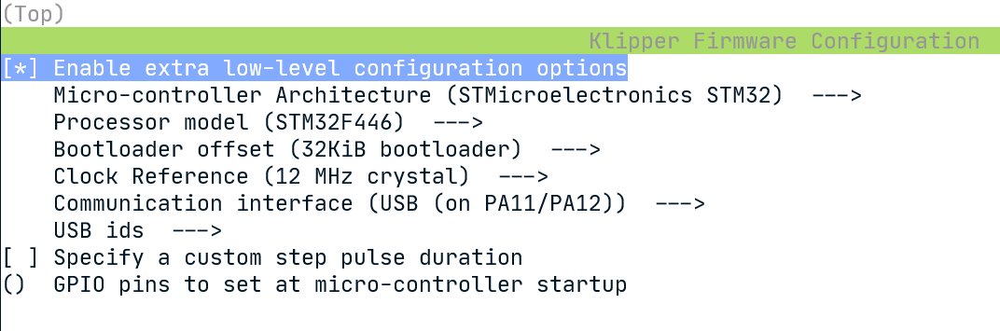
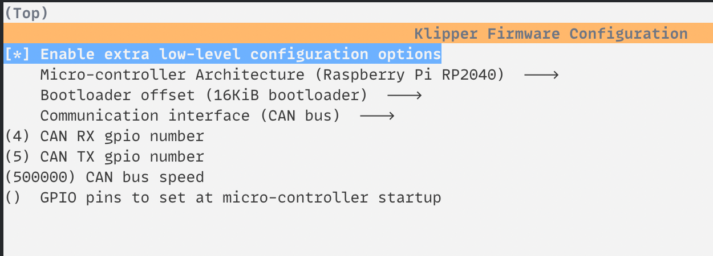

# Flashing MCUs for Voron 2.4

## Fysetc Spider v1.0
```shell
cd ~/klipper
make clean
make menuconfig
make
make flash FLASH_DEVICE=/dev/serial/by-id/usb-Klipper_stm32f446xx_34003D000650305538333620-if00
```

Use the following options for `make menuconfig`:  


## Mellow SB2040

### CANboot
**Warning: you do NOT need to do this every time, only when you are flashing the MCU for the first time or when CANboot needs an update. If you are just updating Klipper on the SB2040 you just need to make sure to set the correct bootloader offset (16KiB).**

Follow the instructions documented in the [CANboot readme](https://github.com/Arksine/CanBoot)

Use the options for `make menuconfig` that are documented in [Mellow's canboot documentation](http://mellow.klipper.cn/#/advanced/canboot).

### SB2040
Assuming the SB2040 has already been flashed with the CANboot bootloader, you can flash klipper using the following commands:
```shell
cd ~/klipper
make clean
make menuconfig
```

Use the following options for `make menuconfig`:  


**Warning: this differs from Mellow's documentation - gpio24 is set by Klipper so you can tell when Klipper has initialized (via an output_pin referencing the status LED), instead of when the Klipper MCU firmware has started.**

You should see the following output when flashing the SB2040:
```shell
> python3 lib/canboot/flash_can.py -i can0 -f ./out/klipper.bin -u 6a117cdb6929
Sending bootloader jump command...
Resetting all bootloader node IDs...
Checking for canboot nodes...
Detected UUID: 6a117cdb6929, Application: CanBoot
Attempting to connect to bootloader
CanBoot Connected
Protocol Version: 1.0.0
Block Size: 64 bytes
Application Start: 0x10004000
MCU type: rp2040
Verifying canbus connection
Flashing '/home/pi/klipper/out/klipper.bin'...

[##################################################]

Write complete: 114 pages
Verifying (block count = 453)...

[##################################################]

Verification Complete: SHA = 4C8A1711DB3C13F60A3BFDB93D01CA8438135932
CAN Flash Success
```
